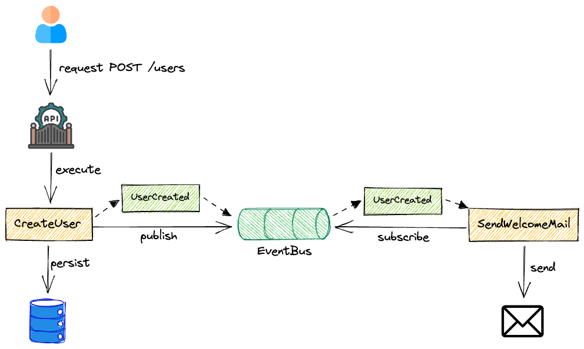

# In-Memory Event Driven Architecture with EventEmitter 

This app is a PoC to show how you can publish/subscribe to events using EventEmitter in Node.js. The example publishes a domain event from the use case layer (*) and the published event is handled by a different use case. 

*Note: Although it is generally said that domain events should be published from Aggregates(the domain layer), this example publishes domain events from the use case layer for simplicity

## Architecture




## Try yourself

```sh
npm install
npm test
npm run dev
```

The server runs on http://localhost:3030. Create a POST request to `http://localhost:3030/users`.

```json
{
	"username": "johndoe",
	"email": "johndoe@test.test"
}
```

You should receive a response similar to the one below:

```json
{
	"id": "7294d859-9beb-49c9-b96f-0f77338dcab5",
	"email": "johndoe@test.test",
	"username": "johndoe"
}
```

Also, you should see a log that indicates a message was sent in the console output:

```sh
send {
  "from": "noreply@test.test",
  "to": "johndoe@test.test",
  "subject": "Welcome!",
  "text": "Welcome aboard!"
}
```